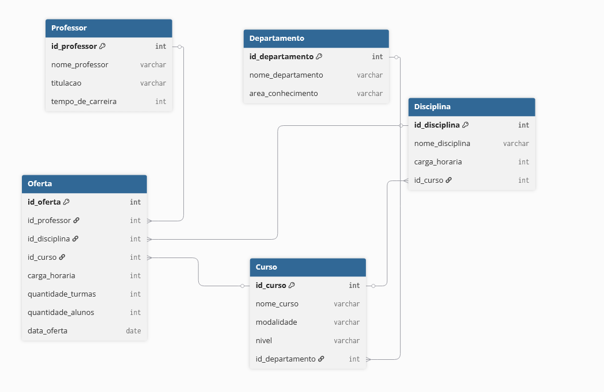
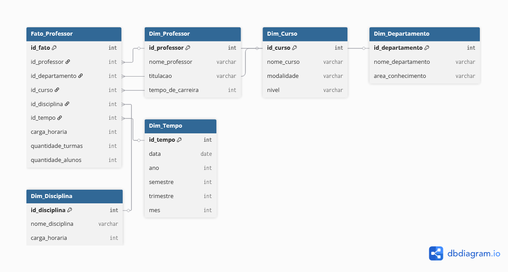

# 📊 Projeto de Modelagem Dimensional – Star Schema (Professores)  Klabin - Excel e Power BI Dashboards bootcamp

Este projeto tem como objetivo a construção de um **modelo dimensional** (esquema em estrela) com foco na análise de **dados relacionados aos Professores**.  

O desafio consiste em transformar um modelo relacional em um modelo dimensional, permitindo análises mais ágeis e estratégicas, utilizando conceitos de **Data Warehousing**.

---



## 🎯 Objetivo

- Criar um **esquema estrela (Star Schema)**.  
- Definir uma **Tabela Fato** central com métricas relevantes.  
- Modelar **Tabelas Dimensão** que enriquecem a análise.  
- Adicionar uma **Dimensão Tempo** para análises históricas.  

> **Obs.:** O modelo foca exclusivamente em dados sobre Professores, não sendo necessário refletir dados individuais de alunos.

---

## 🏗️ Arquitetura do Modelo

O modelo segue a clássica estrutura em **Estrela**:

- **Fato_Professor** → Tabela Fato principal, onde ficam as métricas de análise.  
- **Dimensões** → Tabelas auxiliares que descrevem os contextos:  
  - `Dim_Professor`  
  - `Dim_Curso`  
  - `Dim_Departamento`  
  - `Dim_Disciplina`  
  - `Dim_Tempo`  

---

## 📐 Diagrama Estrela

### Esquema Geral




---

## 🗂️ Estrutura das Tabelas

### **Tabela Fato: `Fato_Professor`**
| Coluna              | Tipo      | Descrição |
|---------------------|-----------|-----------|
| id_fato             | int (PK)  | Identificador único |
| id_professor        | int (FK)  | Chave estrangeira para Dim_Professor |
| id_departamento     | int (FK)  | Chave estrangeira para Dim_Departamento |
| id_curso            | int (FK)  | Chave estrangeira para Dim_Curso |
| id_disciplina       | int (FK)  | Chave estrangeira para Dim_Disciplina |
| id_tempo            | int (FK)  | Chave estrangeira para Dim_Tempo |
| carga_horaria       | int       | Horas dedicadas pelo professor |
| quantidade_turmas   | int       | Número de turmas ministradas |
| quantidade_alunos   | int       | Número total de alunos atendidos |

---

### **Dimensões**

#### 📌 Dim_Professor
- id_professor (PK)  
- nome_professor  
- titulacao  
- tempo_de_carreira  

#### 📌 Dim_Curso
- id_curso (PK)  
- nome_curso  
- modalidade (Presencial / EAD)  
- nivel (Graduação / Pós)  

#### 📌 Dim_Departamento
- id_departamento (PK)  
- nome_departamento  
- area_conhecimento  

#### 📌 Dim_Disciplina
- id_disciplina (PK)  
- nome_disciplina  
- carga_horaria  

#### 📌 Dim_Tempo
- id_tempo (PK)  
- data  
- ano  
- semestre  
- trimestre  
- mes  

---

## 🛠️ Código

```sql
Table Fato_Professor {
  id_fato int [pk, increment] 
  id_professor int [ref: > Dim_Professor.id_professor]
  id_departamento int [ref: > Dim_Departamento.id_departamento]
  id_curso int [ref: > Dim_Curso.id_curso]
  id_disciplina int [ref: > Dim_Disciplina.id_disciplina]
  id_tempo int [ref: > Dim_Tempo.id_tempo]
  carga_horaria int
  quantidade_turmas int
  quantidade_alunos int
}

Table Dim_Professor {
  id_professor int [pk, increment]
  nome_professor varchar
  titulacao varchar
  tempo_de_carreira int
}

Table Dim_Curso {
  id_curso int [pk, increment]
  nome_curso varchar
  modalidade varchar
  nivel varchar
}

Table Dim_Departamento {
  id_departamento int [pk, increment]
  nome_departamento varchar
  area_conhecimento varchar
}

Table Dim_Disciplina {
  id_disciplina int [pk, increment]
  nome_disciplina varchar
  carga_horaria int
}

Table Dim_Tempo {
  id_tempo int [pk, increment]
  data date
  ano int
  semestre int
  trimestre int
  mes int
}


---


